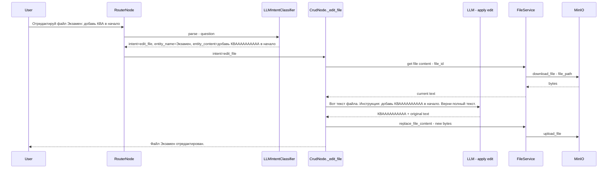
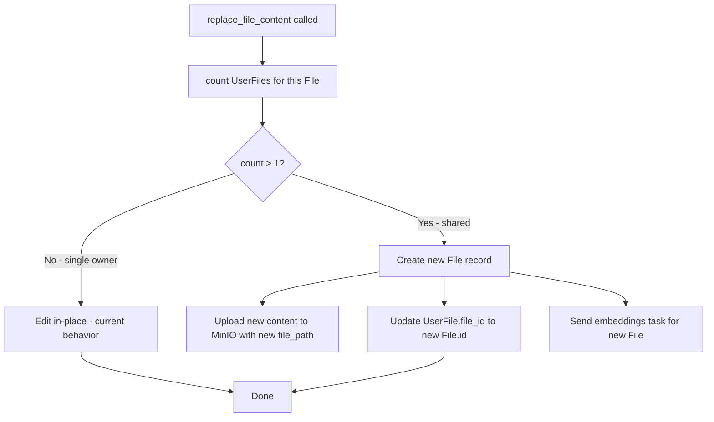

# План: Исправление edit_file — двухфазное редактирование + Copy-on-Write

## Контекст проблемы

Пользователь просит: *"Отредактируй файл Экзамен. Нужно в начале файла перед всем текстом написать: КВАААААААААА"*.  
Файл остаётся неотредактированным. Две корневые причины.

---

## Проблема 1: JSON классификатора обрезается → intent fallback в rag_query

### Диагноз

1. `LLMIntentClassifier.parse()` вызывает LLM с `max_tokens=512` (`app/services/llm_intent_classifier.py:326`).
2. LLM правильно определяет `intent=edit_file`, но пытается вписать **полное новое содержимое файла** в поле `entity_content` JSON-ответа.
3. Содержимое файла «Экзамен» длинное → JSON обрезается на середине → нет закрывающей `}`.
4. `_parse_json()` (`app/services/llm_intent_classifier.py:174`) не находит `{...}` → fallback в `rag_query`.
5. Роутер отправляет в RAG-поиск → бот "отвечает" текстом, но ничего не редактирует.

### Решение: Двухфазное редактирование

**Принцип:** `entity_content` для `edit_file` хранит только **инструкцию по изменению** (краткое описание), а `CrudNode._edit_file()` читает текущий текст файла из MinIO и применяет инструкцию через отдельный LLM-вызов.



### Затрагиваемые файлы

#### 1. `app/services/llm_intent_classifier.py`

**Файл:** `app/services/llm_intent_classifier.py`

**a) Обновить `_SYSTEM_PROMPT` (строка ~90):**

Текущий пример:
```
"измени заметку Идеи: добавь Go в список языков" → {..., "entity_content":"добавь Go в список языков"}
```

Добавить явное правило в секцию edit_file:
```
9. edit_file — изменить содержимое существующего файла.
   entity_content = КРАТКАЯ ИНСТРУКЦИЯ по изменению (НЕ полный текст файла!).
   Примеры инструкций: "добавь в начало: КВАААААААААА", "замени X на Y", "удали абзац про Z".
   entity_name / search_query = название файла.
```

Добавить ещё один пример:
```
"Отредактируй файл Экзамен. Нужно в начале файла написать: КВАААААААААА" → {"intent":"edit_file","search_query":"Экзамен","namespace_hint":null,"search_mode":null,"entity_name":"Экзамен","entity_description":null,"entity_content":"добавь в начало файла: КВАААААААААА"}
```

**b) Улучшить fallback-парсинг в `_parse_json()` (строка ~215-230):**

Сейчас при сломанном JSON извлекается только `intent` через regex. Нужно добавить извлечение `entity_name`, `entity_content`, `search_query`, `namespace_hint` через `_try_extract_str_field()` (уже есть на строке 154). Это позволит не терять intent даже при обрезанном `entity_content`.

Конкретно: после строки 219 (где извлечён `intent_raw`), собрать `ParsedIntent` из regex-полей:
```python
if intent_raw:
    return ParsedIntent(
        intent=intent_raw,
        search_query=_try_extract_str_field(raw, "search_query"),
        namespace_hint=_try_extract_str_field(raw, "namespace_hint"),
        search_mode=_try_extract_str_field(raw, "search_mode"),
        entity_name=_try_extract_str_field(raw, "entity_name"),
        entity_description=_try_extract_str_field(raw, "entity_description"),
        entity_content=_try_extract_str_field(raw, "entity_content"),
    )
```

#### 2. `app/graph/nodes/crud_node.py`

**Файл:** `app/graph/nodes/crud_node.py`

**a) Добавить `llm_service` и `storage` в конструктор `CrudNode`:**

```python
class CrudNode:
    def __init__(
        self,
        *,
        file_service: FileService,
        namespace_service: Optional[NamespaceService] = None,
        llm_service: Optional[LLMProvider] = None,
        storage: Optional[FileStorage] = None,
    ) -> None:
        self.file_service = file_service
        self.namespace_service = namespace_service
        self.llm_service = llm_service
        self.storage = storage
```

**b) Переписать `_edit_file()` (строка 315-357):**

Новая логика:
1. Найти файл по имени (существующий код)
2. Получить `content_file` через `file_repository.get_by_id(user_file.file_id)`
3. Скачать текущий текст из MinIO: `self.storage.download_file(content_file.file_path)`
4. Распарсить текст через `FileReaderFactory` (по расширению)
5. Отправить в LLM промпт: "Вот текст файла: {current_text}. Инструкция: {entity_content}. Верни ПОЛНЫЙ отредактированный текст файла без пояснений."
6. Получить отредактированный текст
7. Вызвать `file_service.replace_file_content()` с новым содержимым

Промпт для LLM (применение правки):
```
Ты редактор текстовых файлов. Тебе дан текущий текст файла и инструкция по его изменению.
Примени инструкцию и верни ПОЛНЫЙ текст файла после изменений. 
НЕ добавляй пояснений, комментариев или markdown-разметки — только чистый текст файла.

[Текущий текст файла]
{current_text}

[Инструкция]
{edit_instruction}
```

#### 3. `app/graph/graph.py`

**Файл:** `app/graph/graph.py`

Обновить создание `CrudNode` в `build_ask_graph()` (строка 131-134):
```python
crud_node = CrudNode(
    file_service=file_service,
    namespace_service=namespace_service,
    llm_service=llm_service,
    storage=file_service.storage,  # FileStorage уже есть в file_service
)
```

---

## Проблема 2: Файл в нескольких пространствах — shared File ломается при edit

### Диагноз

Модель данных: `File` (контент) → `UserFile` (ссылка, 1:N).  
При редактировании `replace_file_content()`:
- Перезаписывает единственный физический файл в MinIO
- Обновляет `content_hash` в `files`
- Удаляет **все** эмбеддинги для `files.id`
- Удаляет **все** суммаризации

Если на один `File` ссылаются несколько `UserFile` (разные пространства) — редактирование одного "экземпляра" ломает все остальные.

### Решение: Copy-on-Write

Перед перезаписью проверять количество `UserFile` для данного `File`. Если больше одного — создать новый `File` и переключить текущий `UserFile` на него.



### Затрагиваемые файлы

#### 4. `app/domain/protocols.py`

**Файл:** `app/domain/protocols.py`

Добавить метод в протокол `UserFileRepository`:
```python
async def count_by_file_id(self, file_id: int) -> int:
    """Количество UserFile, ссылающихся на данный File."""
    ...
```

#### 5. `app/infrastructure/repositories/user_file_repository.py`

**Файл:** `app/infrastructure/repositories/user_file_repository.py`

Добавить реализацию:
```python
async def count_by_file_id(self, file_id: int) -> int:
    from sqlalchemy import func
    result = await self.db.execute(
        select(func.count()).where(UserFile.file_id == file_id)
    )
    return result.scalar_one()
```

#### 6. `app/services/file_service.py`

**Файл:** `app/services/file_service.py`

В методе `replace_file_content()` (строка 983), после проверки владельца (строка ~1006), добавить COW-логику:

```python
# Copy-on-Write: если на File ссылаются несколько UserFile — создаём новый File
ref_count = await self.user_file_repository.count_by_file_id(content_file.id)
if ref_count > 1:
    # Создаём новый File с новым content
    new_object_name = self.storage.generate_object_name(
        user_id=user_id,
        namespace_id=user_file.namespace_id,
        filename=filename,
    )
    await self.storage.upload_file(
        file_content=file_content,
        object_name=new_object_name,
        content_type=self._get_content_type(file_ext),
        metadata={...},
    )
    new_hash = self.compute_content_hash(file_content)[:64]
    new_file = await self.file_repository.create(
        content_hash=new_hash,
        file_path=new_object_name,
        media_metadata={"title": filename, "file_type": file_ext, "file_size": len(file_content)},
        processing_status="pending",
    )
    # Переключаем UserFile на новый File
    # (нужен новый метод update_file_id в UserFileRepository)
    await self.user_file_repository.update_file_id(user_file.id, new_file.id)
    # Запускаем индексацию для нового File
    if publisher:
        publisher.send_embeddings_task(...)
    await self.db.commit()
    return FileInfo(...)
# else: edit in-place (существующий код)
```

#### 7. `app/infrastructure/repositories/user_file_repository.py` (дополнительно)

Добавить метод `update_file_id`:
```python
async def update_file_id(self, user_file_id: int, new_file_id: int) -> Optional[UserFileEntity]:
    result = await self.db.execute(select(UserFile).where(UserFile.id == user_file_id))
    row = result.scalar_one_or_none()
    if row is None:
        return None
    row.file_id = new_file_id
    await self.db.flush()
    return self._to_entity(row)
```

#### 8. `app/domain/protocols.py` (дополнительно)

Добавить `update_file_id` в протокол `UserFileRepository`.

---

## Сводка изменений по файлам

| Файл | Изменение |
|------|-----------|
| `app/services/llm_intent_classifier.py` | Обновить `_SYSTEM_PROMPT` (edit_file = инструкция); улучшить fallback-парсинг с regex-полями |
| `app/graph/nodes/crud_node.py` | Добавить `llm_service`, `storage` в конструктор; переписать `_edit_file()` — читать файл из MinIO, применять инструкцию через LLM |
| `app/graph/graph.py` | Передать `llm_service` и `storage` в `CrudNode` |
| `app/domain/protocols.py` | Добавить `count_by_file_id()` и `update_file_id()` в `UserFileRepository` |
| `app/infrastructure/repositories/user_file_repository.py` | Реализовать `count_by_file_id()` и `update_file_id()` |
| `app/services/file_service.py` | Добавить COW-логику в `replace_file_content()` |

## Порядок реализации

1. `_SYSTEM_PROMPT` + fallback-парсинг (быстрый фикс, сразу снижает частоту ошибок)
2. `CrudNode._edit_file()` двухфазное редактирование + зависимости в `graph.py`
3. `count_by_file_id` + `update_file_id` в репозитории и протоколе
4. COW-логика в `replace_file_content()`
